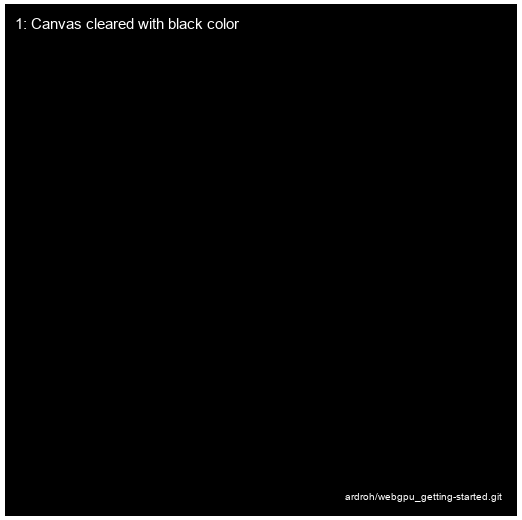

# WebGPU - Getting Started

This is a simple example of how to get started with the WebGPU (based on [Google Materials](https://codelabs.developers.google.com/your-first-webgpu-app))

<!-- Print image docs/slides.gif -->
